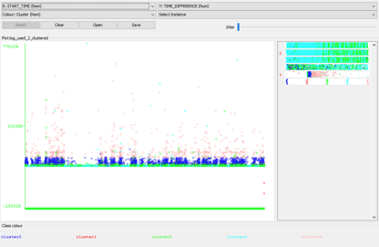

## K- kmeans Clustering

> The k-means clustering algorithm is commonly used for cluster analysis since it is fast and rather easy to implement. The algorithm tries to find groups of data instances with similar size and low variance 

Here we try to take the following feature vectors and try to cluster them for each user and see what stands out.
Feature vectors used : start, time, end time, user, time difference

Tool Used: Weka
Input file: log_used.arff

### Result

The result we get form running a user based profiling is as follows

The interesting point here are the two pinte which are below X axis. They represent two time duration for those two users which are in negative. Which clearly is some anomaly, either in the log or the data.

We also tried with start time vs time duration. But this doesn't give us much insight
